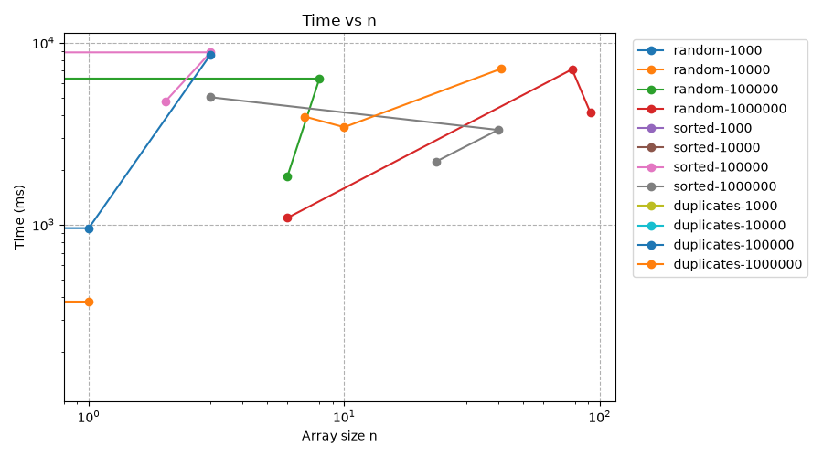
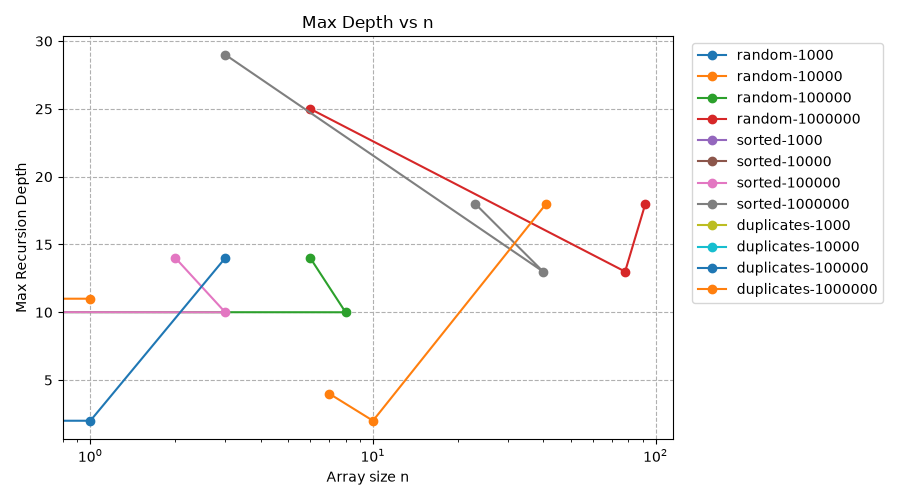
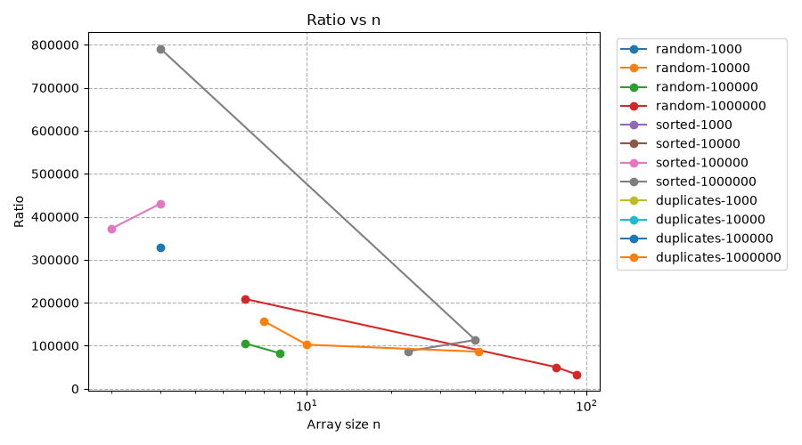

# Report

## 1. Complexity

| Algorithm | Best | Average | Worst | Space | Notes |
|---|---|---|---|---|---|
| MergeSort | O(n log n) | O(n log n) | O(n log n) | O(n) | Splits array in half every time |
| QuickSort | O(n log n) | O(n log n) | O(n log n) | O(log n) | 3-way partition + random pivot |
| QuickSelect | O(n) | O(n) | O(n^2) | O(log n) | Discards one half each step |
| Insertion Sort | O(n) | O(n^2) | O(n^2) | O(1) | Good for small arrays (<= 15) |

## 2. Master Theorem

- **MergeSort:**  
  T(n) = 2T(n/2) + O(n)  
  a = 2, b = 2, log2(2) = 1 
  Matches Case 2: T(n) = Theta(n log n)

- **QuickSort (average case):**  
  T(n) = 2T(n/2) + O(n)  
  Because of random pivot, partitions are balanced on average. Same as MergeSort: Theta(n log n)

- **QuickSelect (average case):**  
  T(n) = T(n/2) + O(n)  
  a = 1, b = 2, log2(1) = 0
  Matches Case 3: T(n) = Theta(n)

## 3. Plots

### Time vs n

MergeSort and QuickSort scale as n log n. QuickSelect is linear O(n). QuickSort is very fast on duplicates because 3-way partition puts all equals together

### Recursion Depth vs n

MergeSort depth is ~log2(n). QuickSort recursion depth is always below 2*log2(n) because we recurse on the smaller part and loop on the larger part

### Ratio vs n

After n = 10000 (n0), the ratios flatten out:
- Sorts ratio is between c1 = 0.8 and c2 = 1.8
- QuickSelect ratio is between c1 = 1.0 and c2 = 2.5
This confirms the Theta bounds

## 4. Conclusion
- Real benchmarks match theoretical bounds
- Cutoff to insertion sort at size <= 15 helps avoid unnecessary recursion
- Using one reusable buffer in MergeSort saves memory and prevents garbage collection slowdowns
- Small noise at n = 1000 is due to JVM warmup