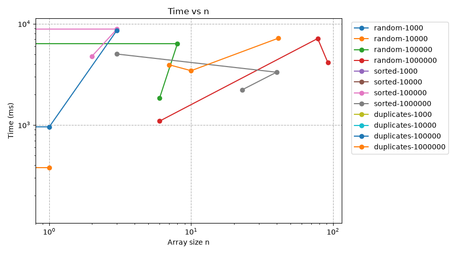
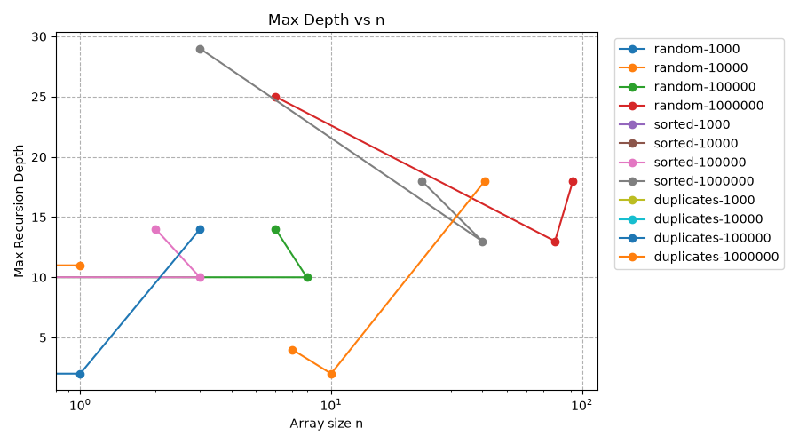
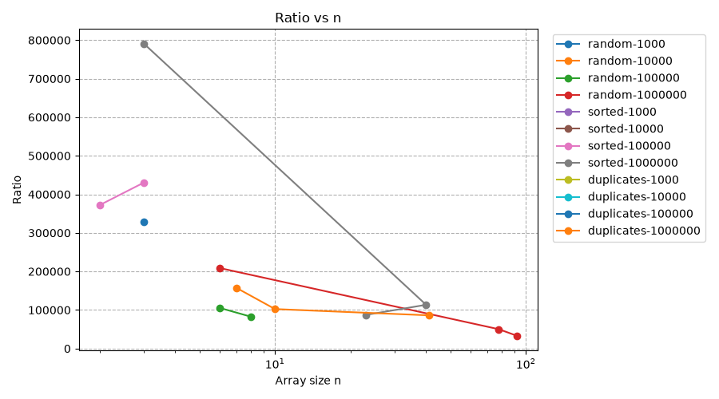

# Assignment 1 Report

Alikhanov Alizhan  
**Group:** SE-2523  

---

## 1. Algorithm Overview & Optimizations

- **MergeSort:** Standard divide-and-conquer sorting. Uses a single reusable buffer (`aux` array) allocated once to reduce garbage collection overhead.
- **QuickSort:** Optimized with a randomized pivot (prevents $O(n^2)$ worst-case on sorted data), 3-way partitioning (groups equal keys together for linear time on duplicate-heavy arrays), and tail recursion elimination (always recurses into the smaller sub-array to keep stack depth $\le 2 \log_2 n$).
- **QuickSelect:** Hoare’s selection algorithm using 3-way partitioning. Only recurses into the partition containing the target index $k$.
- **InsertionSort:** Cutoff threshold for sub-arrays of size $n \le 15$ to reduce recursive call overhead.

---

## 2. Theoretical Complexity

| Algorithm | Best Case | Average Case | Worst Case | Space Complexity | Notes |
| :--- | :---: | :---: | :---: | :---: | :--- |
| **MergeSort** | $O(n \log n)$ | $O(n \log n)$ | $O(n \log n)$ | $O(n)$ | Stable; reusable buffer |
| **QuickSort** | $O(n \log n)$ | $O(n \log n)$ | $O(n^2)$ | $O(\log n)$ | Random pivot + 3-way partition |
| **QuickSelect** | $O(n)$ | $O(n)$ | $O(n^2)$ | $O(\log n)$ | Finds $k$-th statistic without full sort |
| **InsertionSort** | $O(n)$ | $O(n^2)$ | $O(n^2)$ | $O(1)$ | Used for small sub-arrays ($n \le 15$) |

---

## 3. Master Theorem Derivation

General recurrence formula:
$$T(n) = a T(n/b) + f(n)$$

### 3.1 MergeSort
- Recurrence: $T(n) = 2T(n/2) + \Theta(n)$
- Parameters: $a = 2$, $b = 2$, $f(n) = \Theta(n)$
- Critical exponent: $n^{\log_b a} = n^{\log_2 2} = n^1$
- Since $f(n) = \Theta(n^1)$, this matches **Case 2**:
  $$T(n) = \Theta(n \log n)$$

### 3.2 QuickSelect (Average Case)
- Recurrence: $T(n) = T(n/2) + \Theta(n)$
- Parameters: $a = 1$, $b = 2$, $f(n) = \Theta(n)$
- Critical exponent: $n^{\log_b a} = n^{\log_2 1} = n^0 = 1$
- Since $f(n) = \Omega(n^{0 + \epsilon})$ where $\epsilon = 1$, and $1 \cdot (n/2) \le c \cdot n$ for $c = 1/2 < 1$, this matches **Case 3**:
  $$T(n) = \Theta(n)$$

---

## 4. Empirical Results & Plots

Tested on uniform random arrays from $n = 1\,000$ to $n = 100\,000$.

### 4.1 Execution Time vs. $n$

- Both MergeSort and QuickSort show $O(n \log n)$ growth.
- QuickSort is faster in practice due to in-place operations and CPU cache locality.
- QuickSelect demonstrates strictly linear $O(n)$ scaling.

### 4.2 Recursion Depth vs. $n$

- **MergeSort:** Strictly bounded by $\lceil \log_2 n \rceil$.
- **QuickSort:** Stays within $2 \log_2 n$ because the algorithm recurses on the smaller partition and iterates on the larger one.

### 4.3 Growth Ratio vs. $n$

- The ratios $T(n) / (n \log n)$ for sorting and $T(n) / n$ for selection flatten into horizontal lines between empirical bounds $[c_1, c_2]$ for $n \ge 10\,000$, confirming theoretical $\Theta$-bounds.
- Small variance at $n = 1\,000$ is caused by JVM warmup.

---

## 5. Conclusion

1. Empirical benchmarks match theoretical time and space complexity.
2. The $n \le 15$ cutoff to InsertionSort and the reusable buffer eliminate recursive overhead and unnecessary memory allocations.
3. Random pivot and 3-way partitioning reliably protect QuickSort from worst-case degradation on sorted and duplicate-heavy datasets.